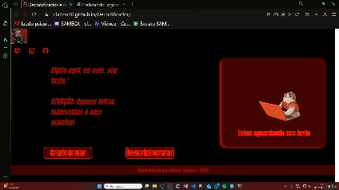

<h1 align="center"> Decodificador textos: Desafio Alura One </h1>

<h2> Descrição: </h2>

Se trata de um decodificador/codificado de texto cujo desenvolvimento é atividade do ONE - Oracle Next Education, programa da Oracle em parceria com a Alura para formação em tecnologia

 

Conforme pode ser visto abaixo, a página possui duas áreas distintas. Uma para informar o texto e outra para para verificar o resultado da codificação/decodificação. Sendo que esta ultima conta com uma função para copia desse resultado

<a href="https://claiton40.github.io/Decodificador/"> Você pode expirementar o decodificador clicando aqui</a>
